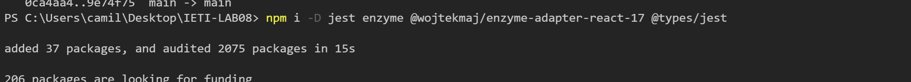

# CodeLab

1. Add the following dependencies:
    ```
    npm i -D jest enzyme @wojtekmaj/enzyme-adapter-react-17 @types/jest
    ```



2. Add an Enzyme Adapter to work with React ( Create a file on the root called **_setupTests.js_**, this will run before each test you write ):

    ```js
    import Enzyme from 'enzyme';
    import Adapter from '@wojtekmaj/enzyme-adapter-react-17';

    Enzyme.configure({ adapter: new Adapter() });
    ```

3. Configure jest so it knows where is the configuration file created in step 2 ( add the following value to your **_package.json_** ):
    ```json
    "jest": {
    	"setupFilesAfterEnv": [
    		"<rootDir>/setupTests.js"
    	]
    }
    ```
4. Create a simple test ( I'll create a test file for my App.js file ), if there is an existing App.test.js delete the content inside of it and replace it by the following:

    ```js
    import { shallow } from 'enzyme';
    import App from './App';

    describe('<App/>', () => {
        it('should render correctly', () => {
            const wrapper = shallow(<App />);
            expect(wrapper).toHaveLength(1);
        });
    });
    ```

5. Read further documentation on how to use enzyme and Jest to test your components (Avoid [Snapshot testing](https://jestjs.io/docs/snapshot-testing), it's better instead to validate if a wrapper is in the DOM as the previous example does)
6. Modify your existing test script like this: _**npm set-script test "jest"**_
7. Install the following dev dependencies: **_npm i -D @babel/preset-env babel-jest_**, those are useful to support EcmaScript modules on your jest files.
8. Create a file called .babelrc at the root directory and add the following lines:
    ```JSON
    {
    	"presets": [
    	  "@babel/preset-env",
    	  "@babel/preset-react", { "runtime": "automatic" }]
    }
    ```
9. Create a folder on the root directory called styleMock.js ( To mock every imported stylesheet )
    ```js
    module.exports = {};
    ```
10. Move your jest configuration to a file called jest.config.js and add the following lines:

    ```js
    module.exports = {
        setupFilesAfterEnv: ['<rootDir>/setupTests.js'],
        moduleNameMapper: {
            '\\.(css)$': '<rootDir>/__mocks__/styleMock.js',
        },
    };
    ```

11. To run your tests run **_npm test_**, check for results and make sure those pass
12. Write tests for your components
13. Run **_npx jest --coverage_** to always check for the code coverage.
